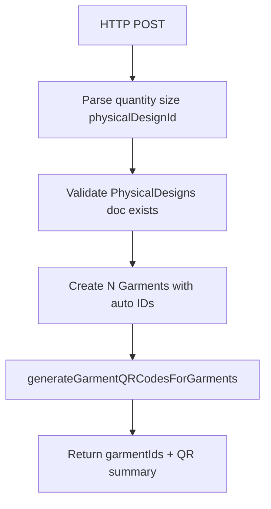

# Generate inventory garments (auto-ID + QR)

## Goal

New Cloud Function (separate from Stripe webhook [`createGarment`](functions/src/createGarment.ts)) that:

1. Accepts **quantity + size** and a valid **`physicalDesignId`**
2. Creates that many `Garments/{autoId}` docs using **Firestore auto-IDs** (`collection.doc()` with no custom id)
3. Leaves **`owner` unset** (inventory not assigned)
4. Leaves **`digitalDesign` unset** until assigned later
5. Calls existing [`generateGarmentQRCodesForGarments`](functions/src/generateGarmentQRCodes.ts) so each garment gets `qr-assets-bucket/Garments/{garmentId}/code_1200x1200.png`



## API

**Name:** `generateInventoryGarments`  
**Type:** `onRequest`, `region: us-central1`, `invoker: "private"` (same pattern as [`generateGarmentQRCodes`](functions/src/generateGarmentQRCodes.ts))  
**Method:** `POST`  
**Body (JSON):**

```json
{
  "physicalDesignId": "abc123",
  "quantity": 50,
  "size": "L"
}
```

Also accept a combined string for convenience (your examples):

```json
{ "physicalDesignId": "abc123", "quantitySize": "50, L" }
```

Parse `"50, L"` → `quantity=50`, `size=L`. If both forms are present, prefer explicit `quantity` + `size`.

**Validation:**

- `physicalDesignId`: non-empty string; `PhysicalDesigns/{id}` must `exists()`
- `quantity`: positive integer; cap at a safe max (e.g. **500**) to avoid huge batches / timeouts
- `size`: one of `XS|S|M|L|XL` (reuse normalize logic from [`createGarment.ts`](functions/src/createGarment.ts))

## Document fields (match Artie DB)

From [`documentation/Artie DB design.txt`](documentation/Artie%20DB%20design.txt) lines 103–117. Write each garment as:

| Field | Value |
|-------|--------|
| `id` | Firestore auto doc id |
| `owner` | **omit** (unset) |
| `digitalDesign` | **omit** (unset) |
| `physicalDesign` | `PhysicalDesigns/{physicalDesignId}` DocumentReference |
| `printStatus` | `"NOT_PRINTED"` |
| `printedAt` | omit until printed |
| `shippedStatus` | `"ORDERED"` |
| `shippedUpdate` | `serverTimestamp()` at create |
| `size` | from request |
| `color` | from `PhysicalDesigns.color` if string; else `"UNSPECIFIED"` |
| `qrCodeStatus` | `"NOT_GENERATED"` initially, then `"GENERATED"` after QR helper (existing helper already sets this) |
| `createdAt` | `serverTimestamp()` (use camelCase to match existing `createGarment`; DB text says `CreatedAt`) |
| `version` | omit unless optional `version` string provided |
| `verificationStatus` | `null` or omit |

Do **not** update `Users.ownedGarments` (no owner yet).

## Implementation steps

### 1. New file [`functions/src/generateInventoryGarments.ts`](functions/src/generateInventoryGarments.ts)

- Parse/validate body
- `get` physical design; fail 400 if missing
- Loop `quantity` times:
  - `const ref = db.collection("Garments").doc()` ← auto GUID
  - `batch.set(ref, payload)` (chunk batches at **400** writes if needed)
- Collect `garmentIds`
- `await generateGarmentQRCodesForGarments(garmentIds)`
- Respond `200` with `{ garmentCount, garmentIds, qrGeneration }`

Reuse shared normalize helpers locally (or small shared util) rather than importing from the Stripe webhook file to avoid coupling.

### 2. Export from [`functions/src/index.ts`](functions/src/index.ts)

```ts
export { generateInventoryGarments } from "./generateInventoryGarments";
```

### 3. Document in [`functions/README.md`](functions/README.md)

Add a `generateInventoryGarments` section that spells out:

**What “IAM private invoker” means**

- Deploy with `invoker: "private"` (same as `generateGarmentQRCodes`).
- The URL is not publicly callable: Cloud Run rejects unauthenticated requests.
- The caller must:
  1. Be a Google identity (user or service account) with **Cloud Run Invoker** on that function.
  2. Send `Authorization: Bearer <identity-token>` (OIDC identity token for the function URL audience, not an API key / Firebase ID token).

**Request shape**

```http
POST / HTTP/1.1
Content-Type: application/json
Authorization: Bearer <gcloud-identity-token>
```

```json
{
  "physicalDesignId": "<PhysicalDesigns doc id>",
  "quantity": 50,
  "size": "L"
}
```

or:

```json
{
  "physicalDesignId": "<PhysicalDesigns doc id>",
  "quantitySize": "50, L"
}
```

**Example curl** (mirror existing QR endpoint style in the README):

```bash
# Requires: gcloud auth login (or ADC) + Cloud Run Invoker on the function
curl -X POST \
  -H "Authorization: Bearer $(gcloud auth print-identity-token)" \
  -H "Content-Type: application/json" \
  -d '{"physicalDesignId":"YOUR_PHYSICAL_DESIGN_ID","quantitySize":"3, S"}' \
  "https://generateinventorygarments-<hash>-uc.a.run.app"
```

Also note: this is **ops inventory creation** (auto-IDs, no owner), not the Stripe webhook `createGarment` path.

## Defaults / decisions locked in

- **Owner:** unset  
- **QR:** yes, via existing helper into `qr-assets-bucket`  
- **Invocation:** private HTTP (ops/admin), not callable  
- **IDs:** Firestore auto-IDs only (no Stripe-style composite ids)

## Test plan

- Valid `physicalDesignId` + `quantitySize: "3, S"` → 3 docs, each with auto id, `size: "S"`, `shippedStatus: "ORDERED"`, no `owner`/`digitalDesign`
- Invalid size / quantity / missing physical design → 400, no writes
- QR objects exist at `Garments/{id}/code_1200x1200.png` and `qrCodeStatus` becomes generated
- Large quantity respects cap / batched writes
